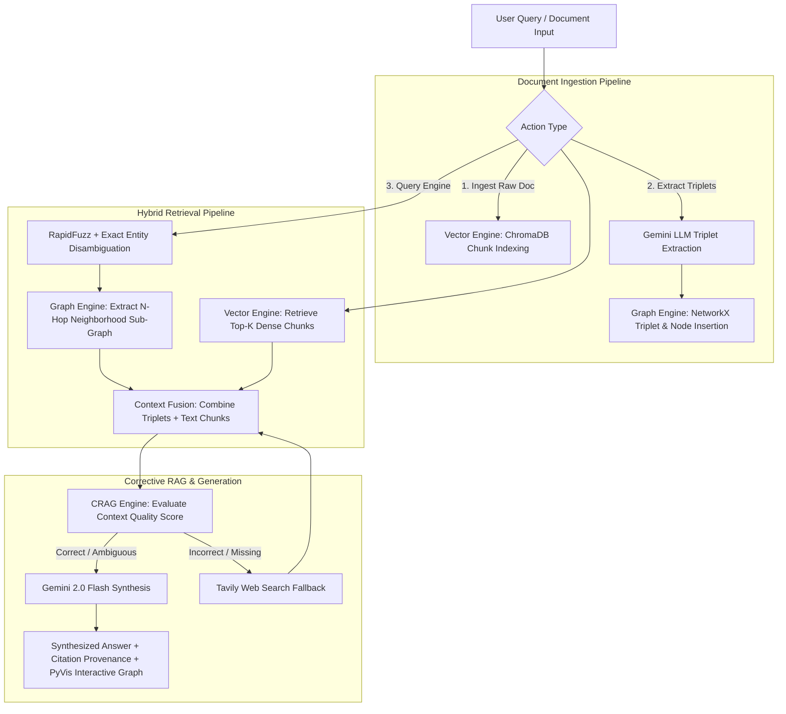

# 🕸️ GraphRAG Enterprise Engine & Benchmark Suite

[](https://www.python.org/)
[](https://fastapi.tiangolo.com/)
[](https://streamlit.io/)
[](https://ai.google.dev/)
[](https://www.docker.com/)
[](LICENSE)

A production-grade **GraphRAG (Knowledge Graph + Dense Vector Search)** engine equipped with **Corrective RAG (CRAG)** fallback, **RapidFuzz** entity disambiguation, GraphML/Neo4j Cypher export tools, Docker containerization, GitHub Actions CI/CD, an offline RAGAS benchmark evaluation suite, a FastAPI REST backend, and an interactive Streamlit dashboard.

---


## 💡 What is This Project & How Does It Work?

Standard Retrieval-Augmented Generation (**Vector-Only RAG**) chunks text into isolated paragraphs and retrieves the top-K similar chunks. However, vector search **fails at multi-hop enterprise queries** that span across interconnected suppliers, components, and regulations (e.g. *"Who supplies microcontrollers for unit ADU-7 and what compliance standards apply?"*).

**GraphRAG Enterprise Engine** solves this by fusing two paradigms:
1. **NetworkX Knowledge Graph**: Extracts structural entity-relation triplets `(Subject --[Relation]--> Object)` and navigates N-hop relational sub-graphs.
2. **ChromaDB Dense Vector Store**: Extracts semantic text Chunks for detailed textual context.
3. **Corrective RAG (CRAG)**: Evaluates context quality with a grader LLM. If context is missing or ambiguous, it automatically triggers a Tavily web search fallback.

---

## 🔄 End-to-End Data Flow



---

## 🌟 Key Features

- **Hybrid Graph + Vector Retrieval**: NetworkX N-hop sub-graph traversal fused with ChromaDB dense vector embeddings.
- **RapidFuzz Entity Matching**: High-performance string matching to resolve query typos (e.g. `"ADU7"` → `"ADU-7"`).
- **Corrective RAG (CRAG)**: Grader LLM evaluates retrieved context and executes live web search fallback when required.
- **Graph Exports**: Export Knowledge Graphs directly into **GraphML XML** (for Gephi visualization) and **Neo4j Cypher** `.cypher` import scripts.
- **RAGAS Benchmark Suite**: Offline evaluator comparing Vector-Only RAG vs GraphRAG across Context Recall, Faithfulness, Hallucination Score, and Latency.
- **Docker Containerization**: Single-command startup with `docker-compose up --build`.
- **GitHub Actions CI/CD**: Automated integration tests on every `git push`.

---

## 📂 Project Structure

```text
GraphRAG/
├── .github/
│   └── workflows/
│       └── ci.yml                       # GitHub Actions CI workflow
├── data/
│   ├── synthetic_enterprise_docs.json   # Synthetic supply-chain & compliance dataset
│   └── eval_benchmark_questions.json    # 35 multi-hop benchmark Q&A pairs
├── src/
│   ├── __init__.py
│   ├── config.py                        # Pydantic BaseSettings environment loader
│   ├── models.py                        # Pydantic data schemas
│   ├── llm_client.py                    # Gemini API wrapper (google-genai SDK)
│   ├── graph_engine.py                  # NetworkX Knowledge Graph, RapidFuzz & Exporters
│   ├── vector_engine.py                 # ChromaDB text chunk vector store
│   ├── hybrid_retriever.py              # Context fusion retriever (Graph + Vector)
│   ├── crag_engine.py                   # Corrective RAG evaluation & Tavily web fallback
│   ├── eval_engine.py                   # Offline RAGAS benchmark suite
│   └── api/
│       ├── __init__.py
│       └── main.py                      # FastAPI REST application endpoints
├── tests/
│   └── test_pipeline.py                 # Automated 7-part unit & integration tests
├── app.py                               # Interactive Streamlit Dashboard
├── Dockerfile                           # Production Docker image configuration
├── docker-compose.yml                   # Microservices orchestrator (Backend + Frontend)
├── requirements.txt                     # Production dependencies
├── .env.example                         # Environment configuration template
├── .gitignore                           # Git exclusion rules
└── README.md                            # Comprehensive documentation
```

---

## 🚀 Quick Start & Local Setup

### 1. Clone & Setup Virtual Environment

```bash
git clone https://github.com/your-username/GraphRAG-Enterprise.git
cd GraphRAG-Enterprise

# Create virtual environment
python -m venv venv

# Activate on Windows (PowerShell):
.\venv\Scripts\Activate

# Activate on macOS/Linux:
source venv/bin/activate

# Install dependencies
pip install -r requirements.txt
```

### 2. Configure Environment Variables

Create a `.env` file in the root directory (or copy `.env.example`):

```env
GEMINI_API_KEY=your_gemini_api_key_here
TAVILY_API_KEY=your_tavily_api_key_here  # Optional: for web search fallback
```

---

## 🏃 Running the Application

### Option A: Local Dual-Service Mode (FastAPI + Streamlit)

**Terminal 1 (FastAPI Backend)**:
```bash
uvicorn src.api.main:app --reload --port 8000
```
- API Documentation (Swagger): `http://localhost:8000/docs`
- Health Status: `http://localhost:8000/api/v1/health`

**Terminal 2 (Streamlit Frontend)**:
```bash
streamlit run app.py
```
- Access Streamlit UI: `http://localhost:8501`

---

### Option B: Docker Containerized Mode

Launch both backend and frontend microservices in Docker:

```bash
docker-compose up --build
```
- Streamlit UI: `http://localhost:8501`
- FastAPI Docs: `http://localhost:8000/docs`

---

## 📥 Knowledge Graph Exporters

The Knowledge Graph can be exported directly from the Streamlit UI (Tab 2) or via REST API endpoints:

1. **GraphML Format (`.graphml`)**:
   - Standard XML format for graph analytics tools like **Gephi**, Cytoscape, or NetworkX.
   - API Endpoint: `GET /api/v1/graph/export/graphml`

2. **Neo4j Cypher Script (`.cypher`)**:
   - Generates Cypher `MERGE` statements to import nodes and relationships directly into **Neo4j Enterprise**.
   - API Endpoint: `GET /api/v1/graph/export/cypher`

---

## 📡 REST API Documentation

| Endpoint | Method | Description |
| :--- | :---: | :--- |
| `/` | `GET` | API Root landing page & link summary |
| `/api/v1/health` | `GET` | Health check & database statistics |
| `/api/v1/ingest` | `POST` | Ingest JSON documents into Graph & Vector databases |
| `/api/v1/query` | `POST` | Execute GraphRAG query with hybrid retrieval & CRAG |
| `/api/v1/eval` | `GET` | Trigger offline benchmark evaluation suite |
| `/api/v1/graph/stats` | `GET` | Knowledge Graph node and edge counts |
| `/api/v1/graph/pyvis` | `GET` | Interactive PyVis network visualization HTML |
| `/api/v1/graph/export/graphml` | `GET` | Download GraphML XML representation |
| `/api/v1/graph/export/cypher` | `GET` | Download Neo4j Cypher import script |

---

